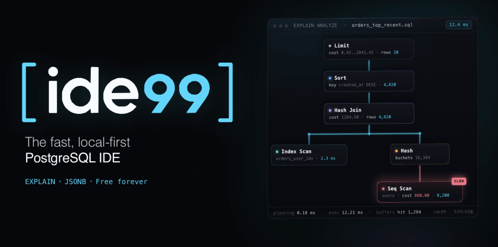

<div align="center">

# ide99

**The fast, local-first PostgreSQL IDE.**
28 MB native desktop app. EXPLAIN plan diff, JSONB tree editor, blocking chains, migrations, pgvector, MCP server for AI agents.

[](https://github.com/exzvor/ide99/releases/latest)
[](https://github.com/exzvor/ide99/releases)
[](https://github.com/exzvor/ide99/stargazers)
[](LICENSE)

[Download](#install) · [Docs](https://ide99.io/docs/) · [Discussions](https://github.com/exzvor/ide99/discussions) · [Why ide99](#why-ide99)

[ide99.io (English)](https://ide99.io) · [ide99.ru (Русский)](https://ide99.ru)

<br/>



</div>

---

## Why ide99

PostgreSQL IDEs are either heavy (DBeaver, DataGrip), dated (pgAdmin), or closed and paid. ide99 is a native ~28 MB desktop app built around the things Postgres developers do every day: explain slow queries, edit JSONB, untangle locks, ship migrations, work with pgvector — and let AI agents work with a real database safely.

|  | ide99 | DBeaver CE | DataGrip | pgAdmin |
|---|---|---|---|---|
| Install size | **~28 MB** | ~600 MB | ~800 MB | ~250 MB |
| Native (no JVM / Electron) | ✅ | ❌ | ❌ | ❌ |
| EXPLAIN plan tree + diff | ✅ | ⚠️ | ⚠️ | ❌ |
| JSONB tree editor | ✅ | ⚠️ | ⚠️ | ❌ |
| Blocking chain DAG | ✅ | ❌ | ❌ | ❌ |
| pgvector / PostGIS / TimescaleDB packs | ✅ | ⚠️ | ⚠️ | ❌ |
| MCP server for AI agents | ✅ | ❌ | ❌ | ❌ |
| Local-first, no cloud proxy | ✅ | ✅ | ✅ | ✅ |
| Open source | ✅ Apache-2.0 | ✅ | ❌ | ✅ |
| Price | **Free forever** | Free / Pro | $229 / yr | Free |

---

## Install

Prebuilt binaries for macOS, Linux and Windows on the [latest release](https://github.com/exzvor/ide99/releases/latest).

| OS | File | Notes |
|---|---|---|
| macOS Apple Silicon | `ide99_<version>_aarch64.pkg` | Recommended on M1/M2/M3/M4 — postinstall script strips `com.apple.quarantine`, so no per-launch Gatekeeper warning |
| macOS Apple Silicon (DMG) | `ide99_<version>_aarch64.dmg` | Drag-to-Applications flow |
| Windows 10/11 | `ide99_<version>_x64-setup.exe` | NSIS installer |
| Windows portable | `ide99_<version>_x64-portable.zip` | Unzip and run — useful if SmartScreen blocks the installer download |
| Linux (any) | `ide99_<version>_amd64.AppImage` | `chmod +x` and run |
| Debian / Ubuntu | `ide99_<version>_amd64.deb` | |
| Fedora / RHEL | `ide99-<version>-1.x86_64.rpm` | |

Verify any download with the SHA256 checksum on the release page.

### Trust & signing status

Builds are currently unsigned; EV code-signing is on the roadmap. Until then:

- **macOS** — install the `.pkg`; subsequent launches are clean. From the `.dmg`, right-click the app on first launch and pick *Open*.
- **Windows** — SmartScreen may flag the installer. Click *More info → Run anyway*, or use the portable `.zip`.
- **Linux** — AppImage / `.deb` / `.rpm` are unsigned but reproducible; verify SHA256.

ide99 is local-first: connections, credentials and query history live in `<data_dir>/ide99/` on your machine. No cloud proxy, no telemetry by default. See [SECURITY.md](SECURITY.md) for the full threat model.

### Package managers

Homebrew, winget, scoop, AUR and Flathub channels are planned.

---

## Build from source

```bash
git clone https://github.com/exzvor/ide99.git
cd ide99
npm install
npm run tauri dev
```

Requires Node.js 20+ and Rust stable ([rustup](https://rustup.rs/)). Tauri prerequisites for your OS: [tauri.app/start/prerequisites](https://tauri.app/start/prerequisites/).

Production bundle:

```bash
npm run tauri build
```

Output lands in `src-tauri/target/release/bundle/` — `.dmg` / `.pkg` on macOS, `.deb` / `.AppImage` / `.rpm` on Linux, `.exe` on Windows.

Useful scripts:

```bash
npm run typecheck            # tsc --noEmit
npm run lint                 # biome check .
npm run test                 # vitest unit tests
cd src-tauri && cargo test
cd src-tauri && cargo clippy -- -D warnings
```

---

## Connect an AI agent (MCP)

ide99 exposes a Model Context Protocol server so Claude Code, Cursor, Windsurf and Cline can read the active connection, the current query and the last result — and propose SQL or EXPLAIN analyses in context. The agent never sees your credentials.

Enable: **Settings → AI / MCP → Enable MCP server**. The *Connect your agent* button generates the JSON snippet for `~/.claude/mcp_servers.json` or `~/.cursor/mcp.json`.

On first connect each client passes an in-IDE authorize flow with explicit scope (`Allow`, `Allow read-only`, `Allow with write access`, `Deny`). Write calls (`run_query_write`, `apply_migration`) additionally require a per-call confirm with SQL preview. Every call is appended to `<data_dir>/mcp-audit.log`.

Full guide: [ide99.io/docs](https://ide99.io/docs/).

---

## All features

<details>
<summary><strong>Editor & query</strong></summary>

- PostgreSQL-aware autocomplete (CTEs, window functions, JSONB operators, `pg_catalog`)
- Monaco-based SQL editor with multi-cursor, snippets, format
- Parameter binding and saved query history
- Virtualised result grid — 50M+ rows at 60 fps
- Multi-tab persistence across sessions

</details>

<details>
<summary><strong>Performance & diagnostics</strong></summary>

- EXPLAIN visualiser with tree view and plan diff (embedded `pev2`)
- Health Screen — bloat, slow queries, missing & unused indexes, one-click fixes
- Live Ops dashboard — sessions, blocking chains (DAG)
- `pg_stat_statements` integration

</details>

<details>
<summary><strong>Schema & migrations</strong></summary>

- ERD + Visual Schema Editor (bidirectional GUI ↔ SQL)
- Object editors: tables, views, materialised views, functions, procedures
- Native migrations with Squawk lint
- Backup / Restore workflows

</details>

<details>
<summary><strong>Extension packs</strong></summary>

- pgvector — vector search, index tuning, recall analysis
- PostGIS — spatial query helpers and map preview
- TimescaleDB, pg_partman, pg_stat_statements, pg_repack

</details>

<details>
<summary><strong>AI & automation</strong></summary>

- MCP server with scoped permissions and audit log
- JSONB tree editor with path autocomplete
- Instant DB (free beta) — on-demand throwaway PostgreSQL instances for prototyping, migration dry-runs and extension probes

</details>

---

## Built on

[Tauri 2.0](https://tauri.app) · [Rust](https://www.rust-lang.org) · [React 18](https://react.dev) · [TypeScript](https://www.typescriptlang.org) · [Monaco](https://microsoft.github.io/monaco-editor/) · [pev2](https://github.com/dalibo/pev2) · [tokio-postgres](https://github.com/sfackler/rust-postgres) · [Radix UI](https://www.radix-ui.com) · [Tailwind v4](https://tailwindcss.com) · [Zustand](https://github.com/pmndrs/zustand)

---

## Contributing & community

- [Discussions](https://github.com/exzvor/ide99/discussions) — feature requests, EXPLAIN puzzles, MCP setups
- [Issues](https://github.com/exzvor/ide99/issues) — bugs with concrete reproductions
- [CONTRIBUTING.md](CONTRIBUTING.md) — dev setup, coding conventions, PR flow
- [SECURITY.md](SECURITY.md) — responsible disclosure
- [CODE_OF_CONDUCT.md](CODE_OF_CONDUCT.md)
- [CHANGELOG.md](CHANGELOG.md)

Localised in English and Russian out of the box.

---

## License

[Apache License 2.0](LICENSE) — free to use, modify and distribute, commercially and otherwise.
